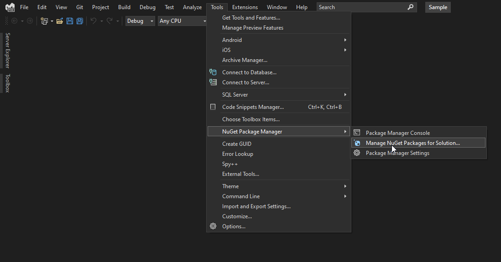
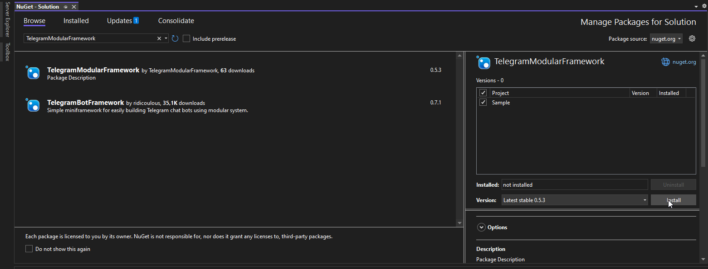
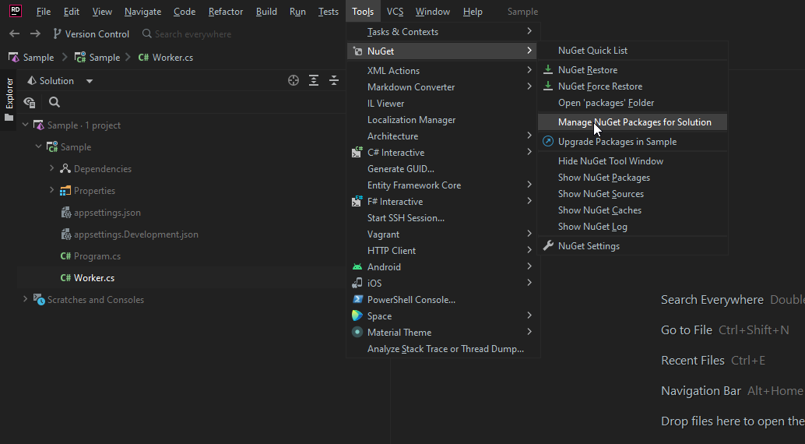
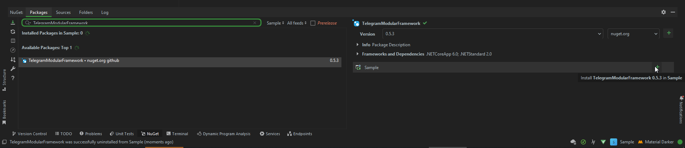

# Installation

# [Visual studio](#tab/vs)

Open nuget manager `Tools -> NuGet Package Manager -> Manage NuGet Packages for Solution`  

  

Search `TelegramModularFramework` package and install it

# [Rider](#tab/rider)

Open nuget manager `Tools -> NuGet -> Manage NuGet Packages for Solution`  

  

Search `TelegramModularFramework` package and install it

# [.NET cli](#tab/cli)

Run `dotnet add package TelegramModularFramework`

***

See [Simple Bot Guide](xref:Guides.GettingStarted.SimpleBot) for example code