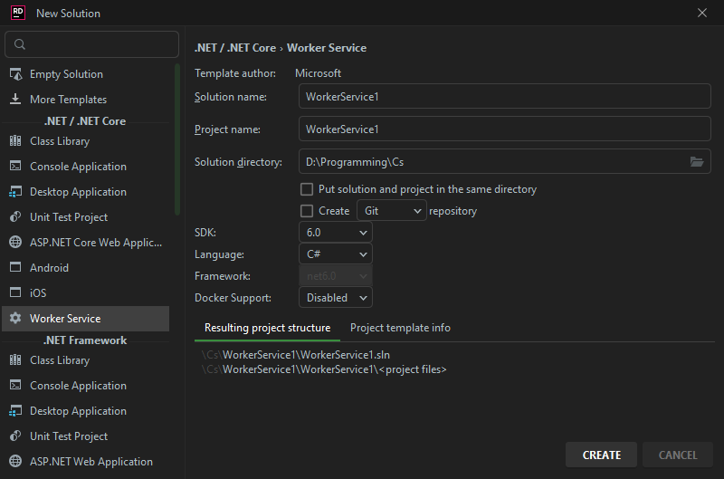

---
title: Project Creation
uid: Guides.GettingStarted.ProjectCreation
---

# Project Creation

This article describes creating
[C# Worker Service](https://learn.microsoft.com/en-us/dotnet/core/extensions/workers)
project  
If you're planing to use Asp.Net please read
[ASP.NET Tutorial](https://dotnet.microsoft.com/en-us/learn/aspnet/hello-world-tutorial/intro)

# [Visual studio](#tab/vs)

Create project with `Worker Service` template

  

Then go-to [Installation Guide](xref:Guides.GettingStarted.Installation?tabs=vs) for further bot creation

# [Rider](#tab/rider)

Create project with `Worker Service` template

  

Then go-to [Installation Guide](xref:Guides.GettingStarted.Installation?tabs=rider) for further bot creatiow

# [.NET cli](#tab/cli)

Create project with `dotnet new worker` command in destination folder   
[Details here](https://learn.microsoft.com/en-us/dotnet/core/tools/dotnet-new-sdk-templates#web-others)  
Then go-to [Installation Guide](xref:Guides.GettingStarted.Installation?tabs=cli) for further bot creatiow

***